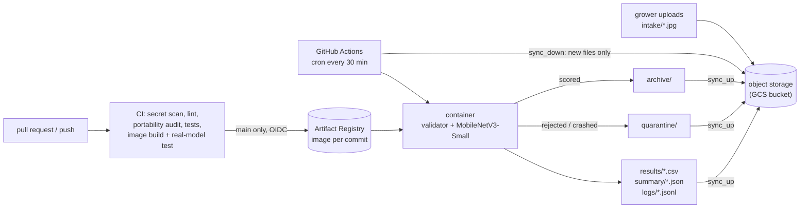

# Lemon Leaf Triage — scheduled batch inference on GCP

Growers upload photos of lemon leaves; every 30 minutes a batch job scores the new photos,
flags leaves that are not healthy for manual inspection, and sets aside photos it should not
trust (blurry, corrupted, not a leaf). Nothing needs to be running between batches.

> Course project (ITCS355). Model accuracy is not the point; the operational system is.

## Who uses it, and what it promises

| | |
|---|---|
| User | An orchard manager who wants a short list of trees to walk to |
| Serving pattern | **Scheduled batch** (not online): leaf photos are not urgent, and batch costs nothing while idle |
| Freshness | A photo uploaded now is scored within ~30 minutes plus job time |
| Output | One CSV row per photo (`class`, `confidence`, `needs_inspection`, `status`) and one summary JSON per batch |

## Architecture



Three layers, same contract as the course portability reference:

1. `src/` — model, validator, batch logic. No provider names, no bucket names.
2. `cloud.env` (gitignored; `cloud.env.ci` carries the non-secret values CI needs) — configuration.
3. `cloudlayer/` — the only code that talks to GCP (`GcpAdapter`). `make portability-audit` enforces it.

The container only sees local folders: it holds no cloud credentials and imports no cloud SDK.
`scripts/sync_down.py` and `scripts/sync_up.py` move files through the adapter.

### Behaviour worth knowing
- **New files only.** A photo is "new" if it is in `intake/` and absent from `archive/` and `quarantine/`. Nothing new means exit immediately, without loading the model.
- **`intake/` is never modified**, so any batch can be replayed (`--reprocess`).
- **One bad file never stops the batch.** Rejected files get a status (`REJECTED_BLURRED`, `REJECTED_OOD_NON_LEAF`, `REJECTED_RESOLUTION`, `REJECTED_CORRUPTED`); anything unexpected becomes `ERROR_UNEXPECTED`. Every file ends up in `archive/` or `quarantine/`.
- **Every log line is JSON and carries the `batch_id`.**

## Quick start (clean clone)

Prerequisites: Python 3.11, Docker, git. Cloud steps additionally need the `gcloud` CLI.

```bash
git clone https://github.com/meadowind/ML-Project.git && cd ML-Project
python -m venv .venv && source .venv/bin/activate
make setup          # pinned dependencies
make lint test portability-audit
make image          # builds lemon-batch:<git sha>
```

Run the whole pipeline locally, with no cloud account (blobs live in `data/_local_blob/`):

```bash
python scripts/make_fixtures.py
CLOUD_PROVIDER=local make demo-upload FILES="tests/fixtures/good_leaf.jpg tests/fixtures/corrupt.jpg"
CLOUD_PROVIDER=local make run-batch
```

Local mode is for development. A real deployment uses the GCP steps below.

### Data and training
```bash
make data     # downloads the pinned dataset revision (~360 MB), builds stratified splits
make train    # writes to reports/repro/lemon_classifier — never overwrites the committed model
```
Dataset: Project-AgML *Lemon Leaf Disease Classification* (Hugging Face), CC BY 4.0, revision
pinned in `data/dataset_lineage.json` together with a hash of the processed folder.
Each training run is tracked in MLflow (`sqlite:///mlflow.db`): parameters, metrics, dataset
revision and hash, git commit; the model files are logged as artifacts (stored in the bucket
when a cloud provider is configured) and registered as a new MLflow model version with alias
`candidate`. The run id is stored in the model manifest. Open the UI with
`mlflow ui --backend-store-uri sqlite:///mlflow.db`.
Training results depend on the PyTorch version (see the model card, "Reproducibility").
The model that serves is committed at `models/registry/lemon_classifier_v2/`
(`model.torchscript.pt` + `model_manifest.json`).

## Deploy it on your own GCP account

```bash
export BILLING_ACCOUNT=XXXXXX-XXXXXX-XXXXXX   # gcloud billing accounts list
export PROJECT_ID=<your-unique-project-id>
export REGION=asia-southeast1
bash infra/setup_gcp.sh          # project, bucket, registry, service account, budget alert
# copy cloud.env.example to cloud.env and paste the values the script prints
make cloud-check                 # all checks must pass
gcloud auth application-default login
make image && make image-push
bash infra/setup_oidc.sh         # lets GitHub Actions in WITHOUT any stored key
```
Then put the same non-secret values in `cloud.env.ci` and update the project number / service
account emails at the top of `.github/workflows/*.yml` (`setup_oidc.sh` prints them).
Resources are labelled `course=itcs355,student=<project>,lab=capstone`.

If `setup_gcp.sh` stops at an `add-iam-policy-binding` step, the Vertex AI service agent was not
created yet: wait a minute and run the script again (it is safe to repeat).

Run a batch by hand: `make demo-upload FILES="…"` then `make run-batch`.

## Model registry
The production model is registered in **Vertex AI Model Registry** through the same adapter layer
(`GcpAdapter.register_model`), with its lineage as labels and, in full, in the version description:
git commit, processed-data hash, MLflow run id, digest-pinned serving image, seed and metrics.
```bash
make image-push                       # or take the digest from the CI build of main
make register-model IMAGE_REF=<registry>/lemon-batch@sha256:...
make reload-check                     # pulls the model back from the registry by alias/version,
                                      # verifies its sha256, scores 5 held-out images
```
Registration needs the Vertex AI service agent to read the bucket and the Artifact Registry
repository; `infra/setup_gcp.sh` grants both. The registered model carries the capstone labels, so
`make teardown` deletes it with everything else.

## CI/CD
| Workflow | Trigger | What it does |
|---|---|---|
| `ci.yml` → `test` | every PR and push | gitleaks over the **full** history, hash-checked install, ruff, portability audit, pytest |
| `ci.yml` → `build` | after `test` | builds the image, then runs the **real model** on a deliberately bad batch (corrupt, blurred, non-leaf, good) and asserts exactly 1 scored and 3 quarantined; a second run must be skipped |
| `ci.yml` → publish step | push to `main` only | pushes the image tagged with the commit, using short-lived OIDC credentials |
| `batch.yml` | cron `*/30`, or manual | pulls new photos; **only if there are some** pulls the image, scores, pushes results |

Pull-request runs have no cloud access. OIDC is restricted to this repository's `main` branch.
Kill switch: set the repository variable `BATCH_ENABLED=false`.
Manual run options: replay everything, or turn the non-leaf guard off (see below).

## Monitoring and alerting
TODO (Member 3): dashboard and alert definitions, the metric names, how to trigger the alert.
Inputs already produced for it: `summary/<batch>.json` (`rejected_rate`, `low_confidence_rate`,
`files_total`, `duration_seconds`) and `logs/<batch>.jsonl`.

## The failure we designed for
A softmax classifier always picks a class, so a photo of something that is **not a leaf** still
gets a confident disease label. The `InputValidator` screens such photos out before the model.

```bash
make image
bash infra/failure_demo.sh path/to/folder_of_non_leaf_photos
```
This scores the same photos with the guard off, then on, and prints both side by side.
Regression tests: `tests/test_batch.py` (`test_non_leaf_scores_confidently_without_guard…`,
`test_ood_guard_is_on_by_default…`). On GitHub: Actions → batch → Run workflow with
`enable_ood_check` unticked.
What it revealed / what we changed: We scored 8 photos that are not lemon leaves (paper, glass, hand, keyboard, brick wall, and photos of other plants). With the guard off, every photo got a disease label, five of them with confidence ≥ 0.90 (a brick wall as Dry_Leaf at 1.00, a keyboard as Anthracnose at 0.93): a softmax classifier always picks a class, so confidence says nothing about whether the input is a leaf. With the guard on, 2 of 8 were rejected (REJECTED_OOD_NON_LEAF); 6 still passed. The guard is a colour check that accepts foliage green, necrotic brown and soot black on purpose, so that real Dry_Leaf and Sooty_Mould leaves are not rejected (0.00% false rejects on the clean data). The cost is that brown or dark non-leaves and other plants can pass. We kept the guard, kept it on by default, and documented the limit instead of tuning thresholds on 8 photos. The proper fix is a learned "not a leaf" check (an extra class or one-class detector trained on non-leaf images); it is not done here. The photos that slipped through had plant-colour ratios of 0.10–0.99, overlapping or exceeding the range of real leaves we scored (0.27–0.62), so no single threshold separates them without rejecting real leaves.

## Cost per 1,000 predictions
TODO: measured numbers. Cost components: scoring time on the runner, storage and operations
in the bucket, registry storage, and image download only for batches that contain new photos.

## Shutting everything down
```bash
make teardown-plan            # lists what would be deleted (labelled buckets, registries, registered models)
make teardown CONFIRM=yes     # deletes them
```
Also disable the schedule (`BATCH_ENABLED=false`, or delete `.github/workflows/batch.yml`), then
check the GCP console and billing page — deletion is asynchronous. The OIDC pool and service
accounts cost nothing; deleting the project removes them too (`gcloud projects delete <id>`).
Verified safe with `bash infra/test_teardown.sh` (throwaway resources only).

## What the live deployment showed
A batch of 7 real test photos uploaded to the bucket was scored by the scheduled workflow on
GitHub: 7 scored, 0 rejected, 3 flagged *needs inspection*. One *Sooty_Mould* leaf
(`test_Sooty_Mould_0017.jpg`) was predicted *Healthy_Leaf* with confidence 0.98 and was not
flagged: a confident miss that the confidence threshold cannot catch (see the model card).

## Model card and limits
See `docs/MODEL_CARD.md`. In short: single-source dataset; class imbalance; some diseased
leaves (Sooty_Mould recall 0.83) are predicted *Healthy*, sometimes confidently, and would not be
flagged. Data and training details: `README_DATA_TRAINING.md`.

## Repository map
```
src/batch/       batch job              src/model/       validator, inference, training
src/config.py    the only env reader    cloudlayer/      GcpAdapter + base interface
scripts/         sync, fixtures, audit  infra/           GCP setup, OIDC, teardown test, demo
tests/           pytest                 .github/workflows/  CI and scheduled batch
models/registry/ committed model        data/            lineage + (ignored) working folders
```
