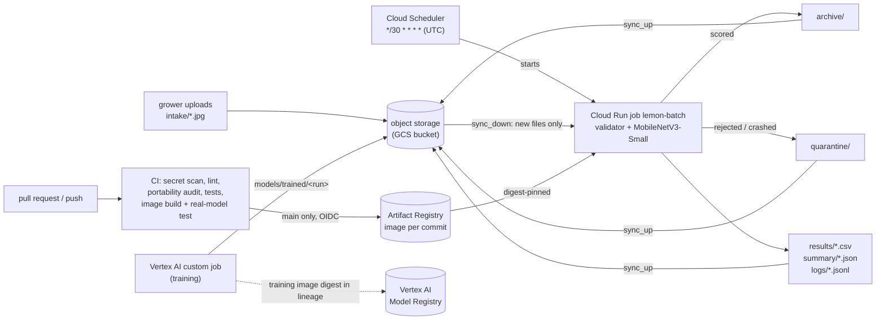

# Lemon Leaf Triage — scheduled batch inference on GCP

Growers upload photos of lemon leaves; every 30 minutes a Cloud Scheduler entry starts a Cloud Run job that scores the new photos,
flags leaves that are not healthy for manual inspection, and sets aside photos it should not
trust (blurry, corrupted, not a leaf). Nothing needs to be running between batches.

> Course project (ITCS355). Model accuracy is not the point; the operational system is.

## Who uses it, and what it promises

| | |
|---|---|
| User | An orchard manager who wants a short list of trees to walk to |
| Serving pattern | **Scheduled batch** (not online): leaf photos are not urgent, and batch costs nothing while idle |
| Freshness | A photo is scored at the next scheduled run: at most 30 minutes plus the job's own run time (about 10 s start-up and 11 s of scoring for 4 photos in our tests). Measured cadence, and the before/after comparison with GitHub's cron, are in "Schedule cadence" |
| Output | One CSV row per photo (`class`, `confidence`, `needs_inspection`, `status`) and one summary JSON per batch |

## Reproduce the model

```bash
make reproduce
```

expected test_accuracy: 0.951 ± 0.020

This one command needs Docker and internet access, and **no cloud account or credentials**. It builds the
training image, rebuilds the dataset from the pinned Hugging Face revision inside the container
(about 360 MB download), trains with the fixed seed, then runs `make verify`, which checks two things:
the processed-data fingerprint equals `data/dataset_lineage.json`, and the test accuracy is within the
claim above. Results are written to `reports/reproduce/` and never touch the committed model.

**Runtime.** About 6 minutes on a MacBook Air (Apple Silicon, running the `linux/amd64` image under
emulation) with the image already built: about 3 minutes to download the dataset and about 2 minutes to train
5 epochs. The very first run also builds the image, which adds the time to download the pinned dependencies.

**What the tolerance covers.** Same code, data, seed and PyTorch version (2.6.0, pinned by hash). On the same
CPU architecture the result is identical: the Vertex AI job (x86-64) and a MacBook running the amd64 image gave
exactly 0.9510. Training directly on an arm64 laptop, outside Docker, gave 0.9608 (2 of the 204 test images
different), which we attribute to CPU floating-point differences. ±0.020 is about 4 images, so a different
x86-64 CPU also passes; we have not tried one. It does **not** cover a different PyTorch version, which gave
0.9412 on the same data, so the version is locked in `requirements-train.lock`. We did not widen the
tolerance to hide non-determinism. The image is built for amd64 on purpose; on Apple Silicon you will see a
platform warning and the run is slower because it is emulated.

## Architecture



Three layers, same contract as the course portability reference:

1. `src/` — model, validator, batch logic. No provider names, no bucket names.
2. `cloud.env` (gitignored; `cloud.env.ci` carries the non-secret values CI needs) — configuration.
3. `cloudlayer/` — the only code that talks to GCP (`GcpAdapter`). `make portability-audit` enforces it.

The scoring code (`src/`) only sees local folders and imports no cloud SDK. Around it,
`scripts/cloud_batch.py` runs one cycle inside the Cloud Run job: `sync_down` (pull new photos) →
score → `sync_up` (push results), moving files through the adapter with the credentials of the job's own
service account (`lemon-batch`, no key files). The image therefore includes the Google Cloud Storage
client (hash-locked in `requirements-cloud.lock`); the portability rule is that only `cloudlayer/` may use it.

### Behaviour worth knowing
- **New files only.** A photo is "new" if it is in `intake/` and absent from `archive/` and `quarantine/`. Nothing new means exit immediately, without loading the model.
- **`intake/` is never modified**, so any batch can be replayed (`--reprocess`).
- **One bad file never stops the batch.** Rejected files get a status (`REJECTED_BLURRED`, `REJECTED_OOD_NON_LEAF`, `REJECTED_RESOLUTION`, `REJECTED_CORRUPTED`); anything unexpected becomes `ERROR_UNEXPECTED`. Every file ends up in `archive/` or `quarantine/`.
- **Every log line is JSON and carries the `batch_id`.**
- **Schedule cadence (changed, with evidence).** The batch first ran from a GitHub Actions cron
  (`*/30 * * * *`). GitHub runs schedules on a best-effort basis, and in our deployment it missed the
  30-minute promise badly. We replaced it with **Cloud Scheduler → Cloud Run job**
  (`infra/setup_cloudrun.sh`, `make deploy-batch`). The job has a 600 s timeout and no retries, so a failed run
  is visible instead of silently repeated.

  | | GitHub Actions cron (before) | Cloud Scheduler → Cloud Run job (after) |
  |---|---|---|
  | Configured | every 30 min | every 30 min |
  | Observed gaps between runs | 4 h 14 m 25 s and 4 h 33 m 54 s | 30 m 03 s, 30 m 00 s, 30 m 00 s |
  | Start vs the scheduled minute | hours late (3 runs in 8 h 48 m, about 17 expected) | 1–4 s after the minute |
  | Worst-case wait for a new photo | more than 4 h 30 m | 30 min + job run time |

  "After" is the first four consecutive scheduler executions (13:30:01, 14:00:04, 14:30:04 and 15:00:04 UTC;
  see `gcloud run jobs executions list --job lemon-batch`). The GitHub workflow is now manual only
  (`workflow_dispatch`), for replays and the failure demo. A run that finds no new photos writes no
  summary and does not load the model.

## Quick start (clean clone)

Prerequisites: Python 3.11, Docker, git. Cloud steps additionally need the `gcloud` CLI.

```bash
git clone https://github.com/meadowind/ML-Project.git && cd ML-Project
python -m venv .venv && source .venv/bin/activate
make setup          # pinned dependencies
make lint test portability-audit
make image          # builds lemon-batch:<git sha>
```

Run the whole pipeline locally, with no cloud account (blobs live in `data/_local_blob/`):

```bash
python scripts/make_fixtures.py
CLOUD_PROVIDER=local make demo-upload FILES="tests/fixtures/good_leaf.jpg tests/fixtures/corrupt.jpg"
CLOUD_PROVIDER=local make run-batch
```

Local mode is for development. A real deployment uses the GCP steps below.

### Data and training
```bash
make data     # downloads the pinned dataset revision (~360 MB), builds stratified splits
make train    # writes to reports/repro/lemon_classifier — never overwrites the committed model
```
Dataset: Project-AgML *Lemon Leaf Disease Classification* (Hugging Face), CC BY 4.0, revision
pinned in `data/dataset_lineage.json` together with a hash of the processed folder.
Each training run is tracked in MLflow (`sqlite:///mlflow.db`): parameters, metrics, dataset
revision and hash, git commit; the model files are logged as artifacts (stored in the bucket
when a cloud provider is configured) and registered as a new MLflow model version with alias
`candidate`. The run id is stored in the model manifest. Open the UI with
`mlflow ui --backend-store-uri sqlite:///mlflow.db`.
Training results depend on the PyTorch version (see the model card, "Reproducibility").

**Training on cloud compute (Vertex AI custom job).** The model that serves was trained in the cloud:
```bash
make train-cloud                              # builds Dockerfile.train, pushes it, submits a Vertex AI custom job, waits
make fetch-trained RUN=<run id>               # downloads, verifies and compares with the committed model
make fetch-trained RUN=<run id> ARGS=--adopt  # copies it to models/registry/ (then open a pull request)
```
The job (CPU, `n1-standard-8`) rebuilds the dataset from the pinned Hugging Face revision and refuses to
train unless its processed-data hash equals the one in `data/dataset_lineage.json`. It writes
`model.torchscript.pt`, `weights.pt` and `model_manifest.json` to `models/trained/<run id>/` in the bucket.
The manifest records the training environment, job id, run id and the **digest of the training image**, and
registration copies them into the model's lineage next to the serving image digest. Current model: run
`train-20261008t140852z`, torch 2.6.0+cpu, test accuracy 95.1% (the model card compares it with the
earlier local run).
The model that serves is committed at `models/registry/lemon_classifier_v2/`
(`model.torchscript.pt` + `model_manifest.json`).

## Deploy it on your own GCP account

```bash
export BILLING_ACCOUNT=XXXXXX-XXXXXX-XXXXXX   # gcloud billing accounts list
export PROJECT_ID=<your-unique-project-id>
export REGION=asia-southeast1
bash infra/setup_gcp.sh          # project, bucket, registry, service account, budget alert
# copy cloud.env.example to cloud.env and paste the values the script prints
make cloud-check                 # all checks must pass
gcloud auth application-default login
make image && make image-push
bash infra/setup_oidc.sh         # lets GitHub Actions in WITHOUT any stored key
```
Then put the same non-secret values in `cloud.env.ci` and update the project number / service
account emails at the top of `.github/workflows/*.yml` (`setup_oidc.sh` prints them).
Resources are labelled `course=itcs355,student=<project>,lab=capstone`.

If `setup_gcp.sh` stops at an `add-iam-policy-binding` step, the Vertex AI service agent was not
created yet: wait a minute and run the script again (it is safe to repeat).

### The scheduled batch (Cloud Run job + Cloud Scheduler)
```bash
make deploy-batch IMAGE_REF=<registry>/lemon-batch@sha256:...   # job, scheduler service account, */30 entry
make demo-upload FILES="a.jpg b.jpg"   # simulate an upload
make run-batch-cloud                   # run the job once now and wait for it
make scheduler-run-now                 # fire the scheduler entry, as the clock would
make scheduler-pause                   # kill switch (make scheduler-resume to restart)
```
The image is pinned by digest. The job runs as `lemon-batch@…`; the scheduler calls the Cloud Run API as
`lemon-scheduler@…`, which only has `run.invoker` on this one job.

Run a batch by hand locally: `make demo-upload FILES="…"` then `make run-batch`.

## Model registry
The production model is registered in **Vertex AI Model Registry** through the same adapter layer
(`GcpAdapter.register_model`), with its lineage as labels and, in full, in the version description:
git commit, processed-data hash, MLflow run id, digest-pinned serving image, training image digest and
Vertex job, seed and metrics.
**How the batch job pins its model:** the Cloud Run job runs a container image that contains exactly
this model (`models/registry/lemon_classifier_v2/`), and the image is pinned by commit tag and digest,
so a batch is replayable against the same model and code. The registry holds the same model with its
lineage, and `make reload-check` proves it can be pulled back by version and used. We chose the image
as the runtime source so that a batch cannot change model between runs without a new deployment.
```bash
make image-push                       # or take the digest from the CI build of main
make register-model IMAGE_REF=<registry>/lemon-batch@sha256:...
make reload-check                     # pulls the model back from the registry by alias/version,
                                      # verifies its sha256, scores 5 held-out images
```
Registration needs the Vertex AI service agent to read the bucket and the Artifact Registry
repository; `infra/setup_gcp.sh` grants both. The registered model carries the capstone labels, so
`make teardown` deletes it with everything else.

## CI/CD
| Workflow | Trigger | What it does |
|---|---|---|
| `ci.yml` → `test` | every PR and push | gitleaks over the **full** history, hash-checked install, ruff, portability audit, pytest |
| `ci.yml` → `build` | after `test` | builds the image, then runs the **real model** on a deliberately bad batch (corrupt, blurred, non-leaf, good) and asserts exactly 1 scored and 3 quarantined; a second run must be skipped |
| `ci.yml` → publish step | push to `main` only | pushes the image tagged with the commit, using short-lived OIDC credentials |
| `ci.yml` → training image | every PR and push | builds `Dockerfile.train` and smoke-tests its imports, so the cloud training job cannot rot |
| `batch.yml` | manual only | replay or failure-demo batch run from GitHub (the schedule lives in Cloud Scheduler) |

Pull-request runs have no cloud access. OIDC is restricted to this repository's `main` branch.
Kill switch: `make scheduler-pause` (pauses the Cloud Scheduler entry; needs the GCP project, not GitHub admin).
Manual run options: replay everything, or turn the non-leaf guard off (see below).
**CI blocks a bad commit.** To show the tests can actually fail, a deliberately broken commit (blur
cutoff set to 0, so blurry photos would be scored) was pushed in a pull request that was never
merged: 6b92682. Two tests fail (`test_status_per_fixture[blurred_leaf.jpg-REJECTED_BLURRED]` and
`test_bad_batch_never_crashes_and_good_files_still_scored`), and the `build` and publish steps do not
run, so nothing broken reaches the registry.

## Monitoring and alerting

The scheduled production batch is monitored with **Cloud Logging** and **Cloud Monitoring**. The
`lemon-batch` Cloud Run Job is started by Cloud Scheduler every 30 minutes.

### Dashboard

The monitoring dashboard is:

* `lemon-batch-monitoring`

It contains four widgets:

1. **Rejected Rate** — rejected file rate for completed batches.
2. **Low Confidence Rate** — low-confidence rate among scored files.
3. **Batch Duration** — duration of completed batch processing.
4. **Successful Batch Executions** — successful `lemon-batch` Cloud Run executions.

### Log-based metrics

The following Cloud Logging metrics are created from `batch_finished` events:

| Metric                            | Meaning                                  |
| --------------------------------- | ---------------------------------------- |
| `lemon-batch-rejected-rate`       | Rejected file rate per completed batch   |
| `lemon-batch-low-confidence-rate` | Low-confidence rate per completed batch  |
| `lemon-batch-duration-seconds`    | Duration of a completed batch in seconds |

The source filter is the `lemon-batch` Cloud Run Job and the `batch_finished` event.

The rejected-rate and low-confidence-rate metrics are Distribution metrics. Their alert policies
use `ALIGN_PERCENTILE_50` to convert each batch's distribution value to a scalar before applying
the threshold.

### Alert policies

Three alert policies are configured:

| Alert policy                            | Trigger                                | Purpose                                             |
| --------------------------------------- | -------------------------------------- | --------------------------------------------------- |
| `lemon-batch-rejected-rate-alert`       | Rejected rate >= 10%                   | Detect an abnormal number of rejected files         |
| `lemon-batch-low-confidence-rate-alert` | Low-confidence rate >= 30%             | Detect batches with unusually uncertain predictions |
| `lemon-batch-missed-run-alert`          | No successful execution for 60 minutes | Detect missed or failed scheduled executions        |

The rate alerts use `COMPARISON_GT` because the current Cloud Monitoring configuration does not
support `COMPARISON_GE` for these conditions. The thresholds are therefore configured as `0.099999`
and `0.299999` to capture the intended 10% and 30% boundaries.

The missed-run alert uses the Cloud Run metric:

```text
run.googleapis.com/job/completed_execution_count
```

filtered to:

```text
metric.labels.result="succeeded"
```

and triggers when no successful execution is observed for 60 minutes.

A `batch_skipped` event caused by an empty intake directory is still a successful Cloud Run
execution. Therefore, an empty batch does not trigger the missed-run alert.

### Batch events used for monitoring

Important Cloud Logging events include:

* `batch_started`
* `model_loaded`
* `file_scored`
* `file_rejected`
* `file_error`
* `batch_finished`
* `batch_skipped`

The `batch_finished` event contains the main operational metrics:

* `batch_id`
* `files_total`
* `files_scored`
* `files_rejected`
* `rejected_rate`
* `low_confidence_count`
* `low_confidence_rate`
* `needs_inspection_count`
* `duration_seconds`

For detailed investigation, the complete batch summary remains available in:

```text
gs://lemon-mlops-project-data/lemon/summary/
```

The summary JSON also contains `confidence_histogram`, `rejected_samples`, and `by_status`, which
are not included in the `batch_finished` log event.

### Useful monitoring commands

View completed batch events:

```bash
gcloud logging read \
  'resource.type="cloud_run_job" AND resource.labels.job_name="lemon-batch" AND jsonPayload.event="batch_finished"' \
  --project=lemon-mlops-project \
  --limit=20
```

View skipped executions:

```bash
gcloud logging read \
  'resource.type="cloud_run_job" AND resource.labels.job_name="lemon-batch" AND jsonPayload.event="batch_skipped"' \
  --project=lemon-mlops-project \
  --limit=20
```

List alert policies:

```bash
gcloud monitoring policies list \
  --project=lemon-mlops-project
```

### Monitoring resources

All monitoring resources created for this project use the `lemon-` prefix:

```text
lemon-batch-rejected-rate
lemon-batch-low-confidence-rate
lemon-batch-duration-seconds

lemon-batch-monitoring

lemon-batch-rejected-rate-alert
lemon-batch-low-confidence-rate-alert
lemon-batch-missed-run-alert
```

These resources should be removed during teardown when they are no longer required.


## The failure we designed for

**What we did.** We scored 8 photos that are not lemon leaves (paper, glass, hand, keyboard, brick wall,
and photos of other plants), first with the non-leaf guard off and then on:
```bash
make image
bash infra/failure_demo.sh path/to/folder_of_non_leaf_photos
```
On GitHub the same switch is Actions → batch → Run workflow with `enable_ood_check` unticked.

**What it revealed.** With the guard off, every photo got a disease label, five of them with confidence
≥ 0.90 (a brick wall as Dry_Leaf at 1.00, a keyboard as Anthracnose at 0.93): a softmax classifier always
picks a class, so confidence says nothing about whether the input is a leaf. With the guard on, 2 of 8 were
rejected (`REJECTED_OOD_NON_LEAF`); 6 still passed. The guard is a colour check that accepts foliage green,
necrotic brown and soot black on purpose, so that real Dry_Leaf and Sooty_Mould leaves are not rejected
(0.00% false rejects on the clean data). The cost is that brown or dark non-leaves and other plants can pass.
The photos that slipped through had plant-colour ratios of 0.10–0.99, overlapping or exceeding the range of
real leaves we scored (0.27–0.62), so no single threshold separates them without rejecting real leaves.

**What we changed.** We kept the guard, kept it on by default, and documented the limit instead of tuning
thresholds on 8 photos. The failure is now fed back into the tests:
- `tests/test_batch.py` (`test_non_leaf_scores_confidently_without_guard…`, `test_ood_guard_is_on_by_default…`);
- `tests/test_failure_regression.py`, which uses real photos from this demo (`tests/failure_cases/`): paper
  and glass must be rejected, and the brick wall, which still gets through, is kept as a strict `xfail` so
  the gap is recorded and the test fails loudly the day the guard starts catching it.

The proper fix is a learned "not a leaf" check (an extra class or a one-class detector trained on non-leaf
images); it is not done here.

## Cost per 1,000 predictions
TODO: measured numbers. Cost components: scoring time on the runner, storage and operations
in the bucket, registry storage, and image download only for batches that contain new photos.

## Shutting everything down
```bash
make scheduler-pause          # stop new runs first
make teardown-plan            # lists what would be deleted (buckets, registries, registered models,
                              # Cloud Run jobs, scheduler entries, training jobs)
make teardown CONFIRM=yes     # deletes them; scheduler entries and Cloud Run jobs go first
```
Then check the GCP console and billing page — deletion is asynchronous. The OIDC pool and service
accounts cost nothing; deleting the project removes them too (`gcloud projects delete <id>`).
Verified safe with `bash infra/test_teardown.sh` (throwaway resources only).

## What the live deployment showed
**On GitHub's cron (first design).** A batch of 7 real test photos was scored by the scheduled workflow:
7 scored, 0 rejected, 3 flagged *needs inspection*. One *Sooty_Mould* leaf
(`test_Sooty_Mould_0017.jpg`) was predicted *Healthy_Leaf* with confidence 0.98 and was not
flagged: a confident miss that the confidence threshold cannot catch (see the model card).
A second batch (`batch-20261007T192733Z`) was picked up without anyone pressing a button: 6 files,
4 scored and 2 rejected (`glass.jpg`, `paper_sheet.jpg`, both `REJECTED_OOD_NON_LEAF`), so
`rejected_rate` was 0.33, above the 0.10 alert threshold. A manual run just before it failed at the upload
step because GitHub's OIDC token service returned HTTP 500; nothing had been written, and the next run
processed the same photos. The runs came 4–5 hours apart, which is why the schedule moved to Cloud Scheduler.

**On Cloud Scheduler + Cloud Run (current).** Scheduler executions started 1–4 s after the minute, every
30 minutes. A manual execution scored a newly uploaded photo and wrote its summary. After the cloud-trained
model (`v2.1.0`) was deployed, 4 new photos (3 *Sooty_Mould*, 1 *Bacterial_Blight*) were scored in 11 s
and all four were flagged.

**A second failure, found by using the system.** In an earlier batch on the cloud-trained model, a
*Sooty_Mould* leaf was scored *Healthy_Leaf* at confidence 0.54 and `needs_inspection` was `false`, although
the data contract says a leaf is flagged when it is not healthy **or** its confidence is below 0.6. The code
only checked the class, and an existing test had the same mistake written into it (a 0.40-confidence
"Healthy" expected to be unflagged). Fixed in `src/batch/run.py`;
`tests/test_batch.py::test_needs_inspection_follows_the_contract` now covers a sure Healthy, an unsure
Healthy and a diseased leaf.

## Model card and limits
See `docs/MODEL_CARD.md`. In short: single-source dataset; class imbalance; some diseased
leaves (Sooty_Mould recall 0.78; 9 of the 10 test errors are diseased leaves called Healthy) are predicted *Healthy*, sometimes confidently, and would not be
flagged. Data and training details: `README_DATA_TRAINING.md`.

## Repository map
```
src/batch/       batch job              src/model/       validator, inference, training
src/config.py    the only env reader    cloudlayer/      GcpAdapter + base interface
scripts/         sync, fixtures, audit  infra/           GCP setup, OIDC, teardown test, demo
tests/           pytest                 .github/workflows/  CI and manual batch
models/registry/ committed model        data/            lineage + (ignored) working folders
```
